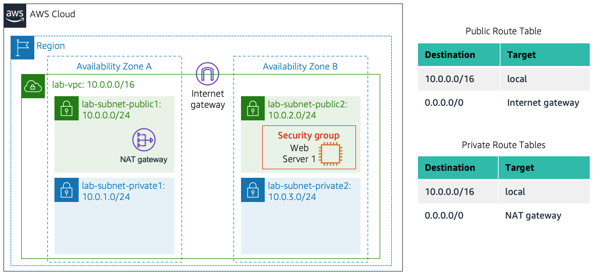

<ol>
    <li>
        <h2 style="-webkit-text-stroke-width:0px;background-color:rgb(255, 255, 255);border-bottom:1px solid rgb(238, 238, 238);box-sizing:border-box;break-after:avoid-page;break-inside:avoid;color:rgb(51, 51, 51);cursor:text;font-family:&quot;Open Sans&quot;, &quot;Clear Sans&quot;, &quot;Helvetica Neue&quot;, Helvetica, Arial, &quot;Segoe UI Emoji&quot;, sans-serif;font-size:1.75em;font-style:normal;font-variant-caps:normal;font-variant-ligatures:normal;letter-spacing:normal;line-height:1.225;margin-bottom:1rem;margin-top:1rem;orphans:4;position:relative;text-align:start;text-decoration-color:initial;text-decoration-style:initial;text-decoration-thickness:initial;text-indent:0px;text-transform:none;white-space:normal;widows:2;width:inherit;word-spacing:0px;" id="task-1-create-your-vpc"><strong>Task 1: Create Your VPC</strong></h2>
        
In this task, you will use the <em style="box-sizing:border-box;"><i>VPC and more</i></em> option in the VPC console to create multiple resources, including a <em style="box-sizing:border-box;"><i>VPC</i></em>, an <em style="box-sizing:border-box;"><i>Internet Gateway</i></em>, a <em style="box-sizing:border-box;"><i>public subnet</i></em> and a <em style="box-sizing:border-box;"><i>private subnet</i></em> in a single Availability Zone, two <em style="box-sizing:border-box;"><i>route tables</i></em>, and a <em style="box-sizing:border-box;"><i>NAT Gateway</i></em>.

    </li>
    <li>
        
In the search box to the right of <i class="fas fa-th" style="-webkit-font-smoothing:antialiased;box-sizing:border-box;display:inline-block;font-family:&quot;Font Awesome 5 Free&quot;;font-style:normal;font-variant:normal;font-weight:900;line-height:1;text-rendering:auto;"></i> <strong style="box-sizing:border-box;">Services</strong>, search for and choose <strong style="box-sizing:border-box;">VPC</strong> to open the VPC console.

    </li>
    <li style="box-sizing:border-box;margin-bottom:0px;margin-right:0px;margin-top:0px;position:relative;white-space:pre-wrap;">
        
Begin creating a VPC.

        <ol style="-webkit-text-stroke-width:0px;background-color:rgb(255, 255, 255);box-sizing:border-box;color:rgb(51, 51, 51);font-family:&quot;Open Sans&quot;, &quot;Clear Sans&quot;, &quot;Helvetica Neue&quot;, Helvetica, Arial, &quot;Segoe UI Emoji&quot;, sans-serif;font-size:16px;font-style:normal;font-variant-caps:normal;font-variant-ligatures:normal;font-weight:400;letter-spacing:normal;margin-bottom:0.8em;margin-right:0px;margin-top:0.8em;orphans:2;padding-left:30px;position:relative;text-align:start;text-decoration-color:initial;text-decoration-style:initial;text-decoration-thickness:initial;text-indent:0px;text-transform:none;white-space:normal;widows:2;word-spacing:0px;">
            <li style="box-sizing:border-box;margin-bottom:0px;margin-right:0px;margin-top:0px;position:relative;white-space:pre-wrap;">
                
In the top right of the screen, verify that <strong style="box-sizing:border-box;">N. Virginia (us-east-1)</strong> is the region.

            </li>
            <li style="box-sizing:border-box;margin-bottom:0px;margin-right:0px;margin-top:0px;position:relative;white-space:pre-wrap;">
                
Choose the <strong style="box-sizing:border-box;">VPC dashboard</strong> link which is also towards the top left of the console.

            </li>
            <li style="box-sizing:border-box;margin-bottom:0px;margin-right:0px;margin-top:0px;position:relative;white-space:pre-wrap;">
                
Next, choose <strong>Create VPC</strong>.

                
<strong style="box-sizing:border-box;">Note</strong>: If you do not see a button with that name, choose the Launch VPC Wizard button instead.

            </li>
        </ol>
        

    </li>
    <li style="box-sizing:border-box;margin-bottom:0px;margin-right:0px;margin-top:0px;position:relative;white-space:pre-wrap;">
        
Configure the VPC details in the <em style="box-sizing:border-box;"><i>VPC settings</i></em> panel on the left:

        <ol style="-webkit-text-stroke-width:0px;background-color:rgb(255, 255, 255);box-sizing:border-box;color:rgb(51, 51, 51);font-family:&quot;Open Sans&quot;, &quot;Clear Sans&quot;, &quot;Helvetica Neue&quot;, Helvetica, Arial, &quot;Segoe UI Emoji&quot;, sans-serif;font-size:16px;font-style:normal;font-variant-caps:normal;font-variant-ligatures:normal;font-weight:400;letter-spacing:normal;margin-bottom:0.8em;margin-right:0px;margin-top:0.8em;orphans:2;padding-left:30px;position:relative;text-align:start;text-decoration-color:initial;text-decoration-style:initial;text-decoration-thickness:initial;text-indent:0px;text-transform:none;white-space:normal;widows:2;word-spacing:0px;">
            <li style="box-sizing:border-box;margin-bottom:0px;margin-right:0px;margin-top:0px;position:relative;white-space:pre-wrap;">
                
Choose <strong style="box-sizing:border-box;">VPC and more</strong>.

            </li>
            <li style="box-sizing:border-box;margin-bottom:0px;margin-right:0px;margin-top:0px;position:relative;white-space:pre-wrap;">
                
Under <strong style="box-sizing:border-box;">Name tag auto-generation</strong>, keep <em style="box-sizing:border-box;"><i>Auto-generate</i></em> selected, however change the value from project to <code style="background-color:rgb(243, 244, 244);border-radius:3px;border:1px solid rgb(231, 234, 237);box-sizing:border-box;font-family:var(--monospace);font-size:0.9em;padding:0px 2px;text-align:left;">lab</code>.

            </li>
            <li style="box-sizing:border-box;margin-bottom:0px;margin-right:0px;margin-top:0px;position:relative;white-space:pre-wrap;">
                
Keep the <strong style="box-sizing:border-box;">IPv4 CIDR block</strong> set to 10.0.0.0/16

            </li>
            <li style="box-sizing:border-box;margin-bottom:0px;margin-right:0px;margin-top:0px;position:relative;white-space:pre-wrap;">
                
For <strong style="box-sizing:border-box;">Number of Availability Zones</strong>, choose <strong style="box-sizing:border-box;">1</strong>.

            </li>
            <li style="box-sizing:border-box;margin-bottom:0px;margin-right:0px;margin-top:0px;position:relative;white-space:pre-wrap;">
                
For <strong style="box-sizing:border-box;">Number of </strong><em style="box-sizing:border-box;"><i><strong style="box-sizing:border-box;">public</strong></i></em><strong style="box-sizing:border-box;"> subnets</strong>, keep the <strong style="box-sizing:border-box;">1</strong> setting.

            </li>
            <li style="box-sizing:border-box;margin-bottom:0px;margin-right:0px;margin-top:0px;position:relative;white-space:pre-wrap;">
                
For <strong style="box-sizing:border-box;">Number of </strong><em style="box-sizing:border-box;"><i><strong style="box-sizing:border-box;">private</strong></i></em><strong style="box-sizing:border-box;"> subnets</strong>, keep the <strong style="box-sizing:border-box;">1</strong> setting.

            </li>
            <li style="box-sizing:border-box;margin-bottom:0px;margin-right:0px;margin-top:0px;position:relative;white-space:pre-wrap;">
                
Expand the <strong style="box-sizing:border-box;">Customize subnets CIDR blocks</strong> section

                <ol style="-webkit-text-stroke-width:0px;background-color:rgb(255, 255, 255);box-sizing:border-box;color:rgb(51, 51, 51);font-family:&quot;Open Sans&quot;, &quot;Clear Sans&quot;, &quot;Helvetica Neue&quot;, Helvetica, Arial, &quot;Segoe UI Emoji&quot;, sans-serif;font-size:16px;font-style:normal;font-variant-caps:normal;font-variant-ligatures:normal;font-weight:400;letter-spacing:normal;margin-bottom:0.8em;margin-right:0px;margin-top:0.8em;orphans:2;padding-left:30px;position:relative;text-align:start;text-decoration-color:initial;text-decoration-style:initial;text-decoration-thickness:initial;text-indent:0px;text-transform:none;white-space:normal;widows:2;word-spacing:0px;">
                    <li style="box-sizing:border-box;margin-bottom:0px;margin-right:0px;margin-top:0px;position:relative;white-space:pre-wrap;">
                        
Change <strong style="box-sizing:border-box;">Public subnet CIDR block in us-east-1a</strong> to <code style="background-color:rgb(243, 244, 244);border-radius:3px;border:1px solid rgb(231, 234, 237);box-sizing:border-box;font-family:var(--monospace);font-size:0.9em;padding:0px 2px;text-align:left;">10.0.0.0/24</code>

                    </li>
                    <li style="box-sizing:border-box;margin-bottom:0px;margin-right:0px;margin-top:0px;position:relative;white-space:pre-wrap;">
                        
Change <strong style="box-sizing:border-box;">Private subnet CIDR block in us-east-1a</strong> to <code style="background-color:rgb(243, 244, 244);border-radius:3px;border:1px solid rgb(231, 234, 237);box-sizing:border-box;font-family:var(--monospace);font-size:0.9em;padding:0px 2px;text-align:left;">10.0.1.0/24</code>

                    </li>
                </ol>
            </li>
            <li style="box-sizing:border-box;margin-bottom:0px;margin-right:0px;margin-top:0px;position:relative;white-space:pre-wrap;">
                
Set <strong style="box-sizing:border-box;">NAT gateways</strong> to <strong style="box-sizing:border-box;">In 1 AZ</strong>.

            </li>
            <li style="box-sizing:border-box;margin-bottom:0px;margin-right:0px;margin-top:0px;position:relative;white-space:pre-wrap;">
                
Set <strong style="box-sizing:border-box;">VPC endpoints</strong> to <strong style="box-sizing:border-box;">None</strong>.

            </li>
            <li style="box-sizing:border-box;margin-bottom:0px;margin-right:0px;margin-top:0px;position:relative;white-space:pre-wrap;">
                
Keep both <strong style="box-sizing:border-box;">DNS hostnames</strong> and <strong style="box-sizing:border-box;">DNS resolution</strong> <em style="box-sizing:border-box;"><i>enabled</i></em>.

                
&nbsp;

            </li>
        </ol>
    </li>
    <li style="box-sizing:border-box;margin-bottom:0px;margin-right:0px;margin-top:0px;position:relative;white-space:pre-wrap;">
        
In the <em style="box-sizing:border-box;"><i>Preview</i></em> panel on the right, confirm the settings you have configured.

        <ol style="-webkit-text-stroke-width:0px;background-color:rgb(255, 255, 255);box-sizing:border-box;color:rgb(51, 51, 51);font-family:&quot;Open Sans&quot;, &quot;Clear Sans&quot;, &quot;Helvetica Neue&quot;, Helvetica, Arial, &quot;Segoe UI Emoji&quot;, sans-serif;font-size:16px;font-style:normal;font-variant-caps:normal;font-variant-ligatures:normal;font-weight:400;letter-spacing:normal;margin-bottom:0.8em;margin-right:0px;margin-top:0.8em;orphans:2;padding-left:30px;position:relative;text-align:start;text-decoration-color:initial;text-decoration-style:initial;text-decoration-thickness:initial;text-indent:0px;text-transform:none;white-space:normal;widows:2;word-spacing:0px;">
            <li style="box-sizing:border-box;margin-bottom:0px;margin-right:0px;margin-top:0px;position:relative;white-space:pre-wrap;">
                
<strong style="box-sizing:border-box;">VPC:</strong> <code style="background-color:rgb(243, 244, 244);border-radius:3px;border:1px solid rgb(231, 234, 237);box-sizing:border-box;font-family:var(--monospace);font-size:0.9em;padding:0px 2px;text-align:left;">lab-vpc</code>

            </li>
            <li style="box-sizing:border-box;margin-bottom:0px;margin-right:0px;margin-top:0px;position:relative;white-space:pre-wrap;">
                
<strong style="box-sizing:border-box;">Subnets</strong>:

                <ol style="-webkit-text-stroke-width:0px;background-color:rgb(255, 255, 255);box-sizing:border-box;color:rgb(51, 51, 51);font-family:&quot;Open Sans&quot;, &quot;Clear Sans&quot;, &quot;Helvetica Neue&quot;, Helvetica, Arial, &quot;Segoe UI Emoji&quot;, sans-serif;font-size:16px;font-style:normal;font-variant-caps:normal;font-variant-ligatures:normal;font-weight:400;letter-spacing:normal;margin-bottom:0.8em;margin-right:0px;margin-top:0.8em;orphans:2;padding-left:30px;position:relative;text-align:start;text-decoration-color:initial;text-decoration-style:initial;text-decoration-thickness:initial;text-indent:0px;text-transform:none;white-space:normal;widows:2;word-spacing:0px;">
                    <li style="box-sizing:border-box;margin-bottom:0px;margin-right:0px;margin-top:0px;position:relative;white-space:pre-wrap;">
                        
us-east-1a

                        <ol style="-webkit-text-stroke-width:0px;background-color:rgb(255, 255, 255);box-sizing:border-box;color:rgb(51, 51, 51);font-family:&quot;Open Sans&quot;, &quot;Clear Sans&quot;, &quot;Helvetica Neue&quot;, Helvetica, Arial, &quot;Segoe UI Emoji&quot;, sans-serif;font-size:16px;font-style:normal;font-variant-caps:normal;font-variant-ligatures:normal;font-weight:400;letter-spacing:normal;margin-bottom:0.8em;margin-right:0px;margin-top:0.8em;orphans:2;padding-left:30px;position:relative;text-align:start;text-decoration-color:initial;text-decoration-style:initial;text-decoration-thickness:initial;text-indent:0px;text-transform:none;white-space:normal;widows:2;word-spacing:0px;">
                            <li style="box-sizing:border-box;margin-bottom:0px;margin-right:0px;margin-top:0px;position:relative;white-space:pre-wrap;">
                                
<em style="box-sizing:border-box;"><i><strong style="box-sizing:border-box;margin-top:0px;">Public</strong></i></em><strong style="box-sizing:border-box;margin-top:0px;"> subnet name:</strong> <code style="background-color:rgb(243, 244, 244);border-radius:3px;border:1px solid rgb(231, 234, 237);box-sizing:border-box;font-family:var(--monospace);font-size:0.9em;padding:0px 2px;text-align:left;">lab-subnet-public1-us-east-1a</code>

                            </li>
                            <li style="box-sizing:border-box;margin-bottom:0px;margin-right:0px;margin-top:0px;position:relative;white-space:pre-wrap;">
                                
<em style="box-sizing:border-box;"><i><strong style="box-sizing:border-box;margin-top:0px;">Private</strong></i></em><strong style="box-sizing:border-box;margin-top:0px;"> subnet name:</strong> <code style="background-color:rgb(243, 244, 244);border-radius:3px;border:1px solid rgb(231, 234, 237);box-sizing:border-box;font-family:var(--monospace);font-size:0.9em;padding:0px 2px;text-align:left;">lab-subnet-private1-us-east-1a</code>

                            </li>
                        </ol>
                    </li>
                </ol>
            </li>
            <li style="box-sizing:border-box;margin-bottom:0px;margin-right:0px;margin-top:0px;position:relative;white-space:pre-wrap;">
                
<strong style="box-sizing:border-box;">Route tables</strong>

                <ol style="-webkit-text-stroke-width:0px;background-color:rgb(255, 255, 255);box-sizing:border-box;color:rgb(51, 51, 51);font-family:&quot;Open Sans&quot;, &quot;Clear Sans&quot;, &quot;Helvetica Neue&quot;, Helvetica, Arial, &quot;Segoe UI Emoji&quot;, sans-serif;font-size:16px;font-style:normal;font-variant-caps:normal;font-variant-ligatures:normal;font-weight:400;letter-spacing:normal;margin-bottom:0.8em;margin-right:0px;margin-top:0.8em;orphans:2;padding-left:30px;position:relative;text-align:start;text-decoration-color:initial;text-decoration-style:initial;text-decoration-thickness:initial;text-indent:0px;text-transform:none;white-space:normal;widows:2;word-spacing:0px;">
                    <li style="box-sizing:border-box;margin-bottom:0px;margin-right:0px;margin-top:0px;position:relative;white-space:pre-wrap;">
                        
<code style="background-color:rgb(243, 244, 244);border-radius:3px;border:1px solid rgb(231, 234, 237);box-sizing:border-box;font-family:var(--monospace);font-size:0.9em;margin-top:0px;padding:0px 2px;text-align:left;">lab-rtb-public</code>

                    </li>
                    <li style="box-sizing:border-box;margin-bottom:0px;margin-right:0px;margin-top:0px;position:relative;white-space:pre-wrap;">
                        
<code style="background-color:rgb(243, 244, 244);border-radius:3px;border:1px solid rgb(231, 234, 237);box-sizing:border-box;font-family:var(--monospace);font-size:0.9em;margin-top:0px;padding:0px 2px;text-align:left;">lab-rtb-private1-us-east-1a</code>

                    </li>
                </ol>
            </li>
            <li style="box-sizing:border-box;margin-bottom:0px;margin-right:0px;margin-top:0px;position:relative;white-space:pre-wrap;">
                
<strong style="box-sizing:border-box;">Network connections</strong>

                <ol style="-webkit-text-stroke-width:0px;background-color:rgb(255, 255, 255);box-sizing:border-box;color:rgb(51, 51, 51);font-family:&quot;Open Sans&quot;, &quot;Clear Sans&quot;, &quot;Helvetica Neue&quot;, Helvetica, Arial, &quot;Segoe UI Emoji&quot;, sans-serif;font-size:16px;font-style:normal;font-variant-caps:normal;font-variant-ligatures:normal;font-weight:400;letter-spacing:normal;margin-bottom:0.8em;margin-right:0px;margin-top:0.8em;orphans:2;padding-left:30px;position:relative;text-align:start;text-decoration-color:initial;text-decoration-style:initial;text-decoration-thickness:initial;text-indent:0px;text-transform:none;white-space:normal;widows:2;word-spacing:0px;">
                    <li style="box-sizing:border-box;margin-bottom:0px;margin-right:0px;margin-top:0px;position:relative;white-space:pre-wrap;">
                        
<code style="background-color:rgb(243, 244, 244);border-radius:3px;border:1px solid rgb(231, 234, 237);box-sizing:border-box;font-family:var(--monospace);font-size:0.9em;margin-top:0px;padding:0px 2px;text-align:left;">lab-igw</code>

                    </li>
                    <li style="box-sizing:border-box;margin-bottom:0px;margin-right:0px;margin-top:0px;position:relative;white-space:pre-wrap;">
                        
<code style="background-color:rgb(243, 244, 244);border-radius:3px;border:1px solid rgb(231, 234, 237);box-sizing:border-box;font-family:var(--monospace);font-size:0.9em;margin-top:0px;padding:0px 2px;text-align:left;">lab-nat-public1-us-east-1a</code>

                    </li>
                </ol>
                
&nbsp;

            </li>
        </ol>
    </li>
    <li style="box-sizing:border-box;margin-bottom:0px;margin-right:0px;margin-top:0px;position:relative;white-space:pre-wrap;">
        
At the bottom of the screen, choose <strong>Create VPC</strong>

        
The VPC resources are created. The NAT Gateway will take a few minutes to activate.

        
Please wait until <em style="box-sizing:border-box;"><i>all</i></em> the resources are created before proceding to the next step.

        
&nbsp;

    </li>
    <li style="box-sizing:border-box;margin-bottom:0px;margin-right:0px;margin-top:0px;position:relative;white-space:pre-wrap;">
        
Once it is complete, choose <strong>View VPC</strong>

        
An <em style="box-sizing:border-box;"><i>Internet gateway</i></em> is a VPC resource that allows communication between EC2 instances in your VPC and the Internet.

        
The <code style="background-color:rgb(243, 244, 244);border-radius:3px;border:1px solid rgb(231, 234, 237);box-sizing:border-box;font-family:var(--monospace);font-size:0.9em;padding:0px 2px;text-align:left;">lab-subnet-public1-us-east-1a</code> public subnet has a CIDR of <strong style="box-sizing:border-box;">10.0.0.0/24</strong>, which means that it contains all IP addresses starting with <strong style="box-sizing:border-box;">10.0.0.x</strong>. The fact the route table associated with this public subnet routes 0.0.0.0/0 network traffic to the internet gateway is what makes it a public subnet.

        
A <em style="box-sizing:border-box;"><i>NAT Gateway</i></em>, is a VPC resource used to provide internet connectivity to any EC2 instances running in <em style="box-sizing:border-box;"><i>private</i></em> subnets in the VPC without those EC2 instances needing to have a direct connection to the internet gateway.

        
The <code style="background-color:rgb(243, 244, 244);border-radius:3px;border:1px solid rgb(231, 234, 237);box-sizing:border-box;font-family:var(--monospace);font-size:0.9em;padding:0px 2px;text-align:left;">lab-subnet-private1-us-east-1a</code> private subnet has a CIDR of <strong style="box-sizing:border-box;">10.0.1.0/24</strong>, which means that it contains all IP addresses starting with <strong style="box-sizing:border-box;">10.0.1.x</strong>.

    </li>
    <li>
        <h2 style="-webkit-text-stroke-width:0px;background-color:rgb(255, 255, 255);border-bottom:1px solid rgb(238, 238, 238);box-sizing:border-box;break-after:avoid-page;break-inside:avoid;color:rgb(51, 51, 51);cursor:text;font-family:&quot;Open Sans&quot;, &quot;Clear Sans&quot;, &quot;Helvetica Neue&quot;, Helvetica, Arial, &quot;Segoe UI Emoji&quot;, sans-serif;font-size:1.75em;font-style:normal;font-variant-caps:normal;font-variant-ligatures:normal;letter-spacing:normal;line-height:1.225;margin-bottom:1rem;margin-top:1rem;orphans:4;position:relative;text-align:start;text-decoration-color:initial;text-decoration-style:initial;text-decoration-thickness:initial;text-indent:0px;text-transform:none;white-space:normal;widows:2;width:inherit;word-spacing:0px;" id="task-2-create-additional-subnets"><strong>Task 2: Create Additional Subnets</strong></h2>
    </li>
    <li>
        
In this task, you will create two additional subnets for the VPC in a second Availability Zone. Having subnets in multiple Availability Zones within a VPC is useful for deploying solutions that provide <em style="box-sizing:border-box;"><i>High Availability</i></em>.

    </li>
    <li>
        
After creating a VPC as you have already done, you can still configure it further, for example, by adding more <strong style="box-sizing:border-box;">subnets</strong>. Each subnet you create resides entirely within one Availability Zone.

    </li>
    <li>
        
&nbsp;

    </li>
    <li style="box-sizing:border-box;margin-bottom:0px;margin-right:0px;margin-top:0px;position:relative;white-space:pre-wrap;">
        
In the left navigation pane, choose <strong style="box-sizing:border-box;">Subnets</strong>.

        
First, you will create a second <em style="box-sizing:border-box;"><i>public</i></em> subnet.

        
&nbsp;

    </li>
    <li style="box-sizing:border-box;margin-bottom:0px;margin-right:0px;margin-top:0px;position:relative;white-space:pre-wrap;">
        
Choose <strong>Create subnet</strong> then configure:

        <ol style="-webkit-text-stroke-width:0px;background-color:rgb(255, 255, 255);box-sizing:border-box;color:rgb(51, 51, 51);font-family:&quot;Open Sans&quot;, &quot;Clear Sans&quot;, &quot;Helvetica Neue&quot;, Helvetica, Arial, &quot;Segoe UI Emoji&quot;, sans-serif;font-size:16px;font-style:normal;font-variant-caps:normal;font-variant-ligatures:normal;font-weight:400;letter-spacing:normal;margin-bottom:0.8em;margin-right:0px;margin-top:0.8em;orphans:2;padding-left:30px;position:relative;text-align:start;text-decoration-color:initial;text-decoration-style:initial;text-decoration-thickness:initial;text-indent:0px;text-transform:none;white-space:normal;widows:2;word-spacing:0px;">
            <li style="box-sizing:border-box;margin-bottom:0px;margin-right:0px;margin-top:0px;position:relative;white-space:pre-wrap;">
                
<strong style="box-sizing:border-box;margin-top:0px;">VPC ID:</strong> <strong style="box-sizing:border-box;">lab-vpc</strong> (select from the menu).

            </li>
            <li style="box-sizing:border-box;margin-bottom:0px;margin-right:0px;margin-top:0px;position:relative;white-space:pre-wrap;">
                
<strong style="box-sizing:border-box;margin-top:0px;">Subnet name:</strong> <code style="background-color:rgb(243, 244, 244);border-radius:3px;border:1px solid rgb(231, 234, 237);box-sizing:border-box;font-family:var(--monospace);font-size:0.9em;padding:0px 2px;text-align:left;">lab-subnet-public2</code>

            </li>
            <li style="box-sizing:border-box;margin-bottom:0px;margin-right:0px;margin-top:0px;position:relative;white-space:pre-wrap;">
                
<strong style="box-sizing:border-box;margin-top:0px;">Availability Zone:</strong> Select the <em style="box-sizing:border-box;"><i>second</i></em> Availability Zone (for example, us-east-1b)

            </li>
            <li style="box-sizing:border-box;margin-bottom:0px;margin-right:0px;margin-top:0px;position:relative;white-space:pre-wrap;">
                
<strong style="box-sizing:border-box;margin-top:0px;">IPv4 CIDR block:</strong> <code style="background-color:rgb(243, 244, 244);border-radius:3px;border:1px solid rgb(231, 234, 237);box-sizing:border-box;font-family:var(--monospace);font-size:0.9em;padding:0px 2px;text-align:left;">10.0.2.0/24</code>

            </li>
        </ol>
        
The subnet will have all IP addresses starting with <strong style="box-sizing:border-box;">10.0.2.x</strong>.

        
&nbsp;

    </li>
    <li style="box-sizing:border-box;margin-bottom:0px;margin-right:0px;margin-top:0px;position:relative;white-space:pre-wrap;">
        
Choose <strong>Create subnet</strong>

        
The second <em style="box-sizing:border-box;"><i>public</i></em> subnet was created. You will now create a second <em style="box-sizing:border-box;"><i>private</i></em> subnet.

        
&nbsp;

    </li>
    <li style="box-sizing:border-box;margin-bottom:0px;margin-right:0px;margin-top:0px;position:relative;white-space:pre-wrap;">
        
Choose <strong>Create subnet</strong> then configure:

        <ol style="-webkit-text-stroke-width:0px;background-color:rgb(255, 255, 255);box-sizing:border-box;color:rgb(51, 51, 51);font-family:&quot;Open Sans&quot;, &quot;Clear Sans&quot;, &quot;Helvetica Neue&quot;, Helvetica, Arial, &quot;Segoe UI Emoji&quot;, sans-serif;font-size:16px;font-style:normal;font-variant-caps:normal;font-variant-ligatures:normal;font-weight:400;letter-spacing:normal;margin-bottom:0.8em;margin-right:0px;margin-top:0.8em;orphans:2;padding-left:30px;position:relative;text-align:start;text-decoration-color:initial;text-decoration-style:initial;text-decoration-thickness:initial;text-indent:0px;text-transform:none;white-space:normal;widows:2;word-spacing:0px;">
            <li style="box-sizing:border-box;margin-bottom:0px;margin-right:0px;margin-top:0px;position:relative;white-space:pre-wrap;">
                
<strong style="box-sizing:border-box;margin-top:0px;">VPC ID:</strong> <code style="background-color:rgb(243, 244, 244);border-radius:3px;border:1px solid rgb(231, 234, 237);box-sizing:border-box;font-family:var(--monospace);font-size:0.9em;padding:0px 2px;text-align:left;">lab-vpc</code>

            </li>
            <li style="box-sizing:border-box;margin-bottom:0px;margin-right:0px;margin-top:0px;position:relative;white-space:pre-wrap;">
                
<strong style="box-sizing:border-box;margin-top:0px;">Subnet name:</strong> <code style="background-color:rgb(243, 244, 244);border-radius:3px;border:1px solid rgb(231, 234, 237);box-sizing:border-box;font-family:var(--monospace);font-size:0.9em;padding:0px 2px;text-align:left;">lab-subnet-private2</code>

            </li>
            <li style="box-sizing:border-box;margin-bottom:0px;margin-right:0px;margin-top:0px;position:relative;white-space:pre-wrap;">
                
<strong style="box-sizing:border-box;margin-top:0px;">Availability Zone:</strong> Select the <em style="box-sizing:border-box;"><i>second</i></em> Availability Zone (for example, us-east-1b)

            </li>
            <li style="box-sizing:border-box;margin-bottom:0px;margin-right:0px;margin-top:0px;position:relative;white-space:pre-wrap;">
                
<strong style="box-sizing:border-box;margin-top:0px;">IPv4 CIDR block:</strong> <code style="background-color:rgb(243, 244, 244);border-radius:3px;border:1px solid rgb(231, 234, 237);box-sizing:border-box;font-family:var(--monospace);font-size:0.9em;padding:0px 2px;text-align:left;">10.0.3.0/24</code>

            </li>
        </ol>
        
The subnet will have all IP addresses starting with <strong style="box-sizing:border-box;">10.0.3.x</strong>.

        
&nbsp;

    </li>
    <li style="box-sizing:border-box;margin-bottom:0px;margin-right:0px;margin-top:0px;position:relative;white-space:pre-wrap;">
        
Choose <strong>Create subnet</strong>

        
The second <em style="box-sizing:border-box;"><i>private</i></em> subnet was created.

        
You will now configure this new <em style="box-sizing:border-box;"><i>private</i></em> subnet to route internet-bound traffic to the NAT Gateway so that resources in the second private subnet are able to connect to the Internet, while still keeping the resources private. This is done by configuring a <em style="box-sizing:border-box;"><i>Route Table</i></em>.

        
A <em style="box-sizing:border-box;"><i>route table</i></em> contains a set of rules, called <em style="box-sizing:border-box;"><i>routes</i></em>, that are used to determine where network traffic is directed. Each subnet in a VPC must be associated with a route table; the route table controls routing for the subnet.

        
&nbsp;

    </li>
    <li style="box-sizing:border-box;margin-bottom:0px;margin-right:0px;margin-top:0px;position:relative;white-space:pre-wrap;">
        
In the left navigation pane, choose <strong style="box-sizing:border-box;">Route tables</strong>.

        
&nbsp;

    </li>
    <li style="box-sizing:border-box;margin-bottom:0px;margin-right:0px;margin-top:0px;position:relative;white-space:pre-wrap;">
        
Select <i class="far fa-check-square" style="-webkit-font-smoothing:antialiased;box-sizing:border-box;display:inline-block;font-family:&quot;Font Awesome 5 Free&quot;;font-style:normal;font-variant:normal;font-weight:400;line-height:1;text-rendering:auto;"></i> the <strong style="box-sizing:border-box;">lab-rtb-private1-us-east-1a</strong> route table.

        
&nbsp;

    </li>
    <li style="box-sizing:border-box;margin-bottom:0px;margin-right:0px;margin-top:0px;position:relative;white-space:pre-wrap;">
        
In the lower pane, choose the <strong style="box-sizing:border-box;">Routes</strong> tab.

        
Note that <strong style="box-sizing:border-box;">Destination 0.0.0.0/0</strong> is set to <strong style="box-sizing:border-box;">Target nat-xxxxxxxx</strong>. This means that traffic destined for the internet (0.0.0.0/0) will be sent to the NAT Gateway. The NAT Gateway will then forward the traffic to the internet.

        
This route table is therefore being used to route traffic from private subnets.

        
&nbsp;

    </li>
    <li style="box-sizing:border-box;margin-bottom:0px;margin-right:0px;margin-top:0px;position:relative;white-space:pre-wrap;">
        
Choose the <strong style="box-sizing:border-box;">Subnet associations</strong> tab.

        
You created this route table in task 1 when you chose to create a VPC and multiple resources in the VPC. That action also created <em style="box-sizing:border-box;"><i>lab-subnet-private-1</i></em> and associated that subnet with this route table.

        
Now that you have created another private subnet, lab-subnet-private-2, you will associate this route table with that subnet as well.

        
&nbsp;

    </li>
    <li style="box-sizing:border-box;margin-bottom:0px;margin-right:0px;margin-top:0px;position:relative;white-space:pre-wrap;">
        
In the Explicit subnet associations panel, choose <strong>Edit subnet associations</strong>

    </li>
    <li>
        
&nbsp;

    </li>
    <li style="box-sizing:border-box;margin-bottom:0px;margin-right:0px;margin-top:0px;position:relative;white-space:pre-wrap;">
        
Leave <strong style="box-sizing:border-box;">lab-subnet-private1-us-east-1a</strong> selected, but also select <i class="far fa-check-square" style="-webkit-font-smoothing:antialiased;box-sizing:border-box;display:inline-block;font-family:&quot;Font Awesome 5 Free&quot;;font-style:normal;font-variant:normal;font-weight:400;line-height:1;text-rendering:auto;"></i> <strong style="box-sizing:border-box;">lab-subnet-private2</strong>.

        
&nbsp;

    </li>
    <li style="box-sizing:border-box;margin-bottom:0px;margin-right:0px;margin-top:0px;position:relative;white-space:pre-wrap;">
        
Choose <strong>Save associations</strong>

        
You will now configure the Route Table that is used by the Public Subnets.

        
&nbsp;

    </li>
    <li style="box-sizing:border-box;margin-bottom:0px;margin-right:0px;margin-top:0px;position:relative;white-space:pre-wrap;">
        
Select the <i class="far fa-check-square" style="-webkit-font-smoothing:antialiased;box-sizing:border-box;display:inline-block;font-family:&quot;Font Awesome 5 Free&quot;;font-style:normal;font-variant:normal;font-weight:400;line-height:1;text-rendering:auto;"></i> <strong style="box-sizing:border-box;">lab-rtb-public</strong> route table (and deselect any other subnets).

        
&nbsp;

    </li>
    <li style="box-sizing:border-box;margin-bottom:0px;margin-right:0px;margin-top:0px;position:relative;white-space:pre-wrap;">
        
In the lower pane, choose the <strong style="box-sizing:border-box;">Routes</strong> tab.

        
Note that <strong style="box-sizing:border-box;">Destination 0.0.0.0/0</strong> is set to Target <strong style="box-sizing:border-box;">igw-xxxxxxxx</strong>, which is an Internet Gateway. This means that internet-bound traffic will be sent straight to the internet via this Internet Gateway.

        
You will now associate this route table to the second public subnet you created.

        
&nbsp;

    </li>
    <li style="box-sizing:border-box;margin-bottom:0px;margin-right:0px;margin-top:0px;position:relative;white-space:pre-wrap;">
        
Choose the <strong style="box-sizing:border-box;">Subnet associations</strong> tab.

        
&nbsp;

    </li>
    <li style="box-sizing:border-box;margin-bottom:0px;margin-right:0px;margin-top:0px;position:relative;white-space:pre-wrap;">
        
In the Explicit subnet associations area, choose <strong>Edit subnet associations</strong>

        
&nbsp;

    </li>
    <li style="box-sizing:border-box;margin-bottom:0px;margin-right:0px;margin-top:0px;position:relative;white-space:pre-wrap;">
        
Leave <strong style="box-sizing:border-box;">lab-subnet-public1-us-east-1a</strong> selected, but also select <i class="far fa-check-square" style="-webkit-font-smoothing:antialiased;box-sizing:border-box;display:inline-block;font-family:&quot;Font Awesome 5 Free&quot;;font-style:normal;font-variant:normal;font-weight:400;line-height:1;text-rendering:auto;"></i> <strong style="box-sizing:border-box;">lab-subnet-public2</strong>.

        
&nbsp;

    </li>
    <li style="box-sizing:border-box;margin-bottom:0px;margin-right:0px;margin-top:0px;position:relative;white-space:pre-wrap;">
        
Choose <strong>Save associations</strong>

        
Your VPC now has public and private subnets configured in two Availability Zones. The route tables you created in task 1 have also been updated to route network traffic for the two new subnets.

    </li>
    <li>
        <h2 style="-webkit-text-stroke-width:0px;background-color:rgb(255, 255, 255);border-bottom:1px solid rgb(238, 238, 238);box-sizing:border-box;break-after:avoid-page;break-inside:avoid;color:rgb(51, 51, 51);cursor:text;font-family:&quot;Open Sans&quot;, &quot;Clear Sans&quot;, &quot;Helvetica Neue&quot;, Helvetica, Arial, &quot;Segoe UI Emoji&quot;, sans-serif;font-size:1.75em;font-style:normal;font-variant-caps:normal;font-variant-ligatures:normal;letter-spacing:normal;line-height:1.225;margin-bottom:1rem;margin-top:1rem;orphans:4;position:relative;text-align:start;text-decoration-color:initial;text-decoration-style:initial;text-decoration-thickness:initial;text-indent:0px;text-transform:none;white-space:normal;widows:2;width:inherit;word-spacing:0px;" id="task-3-create-a-vpc-security-group"><strong>Task 3: Create a VPC Security Group</strong></h2>
    </li>
    <li>
        
In this task, you will create a VPC security group, which acts as a virtual firewall. When you launch an instance, you associate one or more security groups with the instance. You can add rules to each security group that allow traffic to or from its associated instances.

    </li>
    <li>
        
&nbsp;

    </li>
    <li style="box-sizing:border-box;margin-bottom:0px;margin-right:0px;margin-top:0px;position:relative;white-space:pre-wrap;">
        
In the left navigation pane, choose <strong style="box-sizing:border-box;">Security groups</strong>.

        
&nbsp;

    </li>
    <li style="box-sizing:border-box;margin-bottom:0px;margin-right:0px;margin-top:0px;position:relative;white-space:pre-wrap;">
        
Choose <strong>Create security group</strong> and then configure:

        <ol style="-webkit-text-stroke-width:0px;background-color:rgb(255, 255, 255);box-sizing:border-box;color:rgb(51, 51, 51);font-family:&quot;Open Sans&quot;, &quot;Clear Sans&quot;, &quot;Helvetica Neue&quot;, Helvetica, Arial, &quot;Segoe UI Emoji&quot;, sans-serif;font-size:16px;font-style:normal;font-variant-caps:normal;font-variant-ligatures:normal;font-weight:400;letter-spacing:normal;margin-bottom:0.8em;margin-right:0px;margin-top:0.8em;orphans:2;padding-left:30px;position:relative;text-align:start;text-decoration-color:initial;text-decoration-style:initial;text-decoration-thickness:initial;text-indent:0px;text-transform:none;white-space:normal;widows:2;word-spacing:0px;">
            <li style="box-sizing:border-box;margin-bottom:0px;margin-right:0px;margin-top:0px;position:relative;white-space:pre-wrap;">
                
<strong style="box-sizing:border-box;">Security group name:</strong> <code style="background-color:rgb(243, 244, 244);border-radius:3px;border:1px solid rgb(231, 234, 237);box-sizing:border-box;font-family:var(--monospace);font-size:0.9em;padding:0px 2px;text-align:left;">Web Security Group</code>

            </li>
            <li style="box-sizing:border-box;margin-bottom:0px;margin-right:0px;margin-top:0px;position:relative;white-space:pre-wrap;">
                
<strong style="box-sizing:border-box;">Description:</strong> <code style="background-color:rgb(243, 244, 244);border-radius:3px;border:1px solid rgb(231, 234, 237);box-sizing:border-box;font-family:var(--monospace);font-size:0.9em;padding:0px 2px;text-align:left;">Enable HTTP access</code>

            </li>
            <li style="box-sizing:border-box;margin-bottom:0px;margin-right:0px;margin-top:0px;position:relative;white-space:pre-wrap;">
                
<strong style="box-sizing:border-box;">VPC:</strong> choose the X to remove the currently selected VPC, then from the drop down list choose <strong style="box-sizing:border-box;">lab-vpc</strong>

                
&nbsp;

            </li>
        </ol>
    </li>
    <li style="box-sizing:border-box;margin-bottom:0px;margin-right:0px;margin-top:0px;position:relative;white-space:pre-wrap;">
        
In the <strong style="box-sizing:border-box;">Inbound rules</strong> pane, choose <strong>Add rule</strong>

        
&nbsp;

    </li>
    <li style="box-sizing:border-box;margin-bottom:0px;margin-right:0px;margin-top:0px;position:relative;white-space:pre-wrap;">
        
Configure the following settings:

        <ol style="-webkit-text-stroke-width:0px;background-color:rgb(255, 255, 255);box-sizing:border-box;color:rgb(51, 51, 51);font-family:&quot;Open Sans&quot;, &quot;Clear Sans&quot;, &quot;Helvetica Neue&quot;, Helvetica, Arial, &quot;Segoe UI Emoji&quot;, sans-serif;font-size:16px;font-style:normal;font-variant-caps:normal;font-variant-ligatures:normal;font-weight:400;letter-spacing:normal;margin-bottom:0.8em;margin-right:0px;margin-top:0.8em;orphans:2;padding-left:30px;position:relative;text-align:start;text-decoration-color:initial;text-decoration-style:initial;text-decoration-thickness:initial;text-indent:0px;text-transform:none;white-space:normal;widows:2;word-spacing:0px;">
            <li style="box-sizing:border-box;margin-bottom:0px;margin-right:0px;margin-top:0px;position:relative;white-space:pre-wrap;">
                
<strong style="box-sizing:border-box;">Type:</strong> <em style="box-sizing:border-box;"><i>HTTP</i></em>

            </li>
            <li style="box-sizing:border-box;margin-bottom:0px;margin-right:0px;margin-top:0px;position:relative;white-space:pre-wrap;">
                
<strong style="box-sizing:border-box;">Source:</strong> <em style="box-sizing:border-box;"><i>Anywhere-IPv4</i></em>

            </li>
            <li style="box-sizing:border-box;margin-bottom:0px;margin-right:0px;margin-top:0px;position:relative;white-space:pre-wrap;">
                
<strong style="box-sizing:border-box;">Description:</strong> <code style="background-color:rgb(243, 244, 244);border-radius:3px;border:1px solid rgb(231, 234, 237);box-sizing:border-box;font-family:var(--monospace);font-size:0.9em;padding:0px 2px;text-align:left;">Permit web requests</code>

                
&nbsp;

            </li>
        </ol>
    </li>
    <li style="box-sizing:border-box;margin-bottom:0px;margin-right:0px;margin-top:0px;position:relative;white-space:pre-wrap;">
        
Scroll to the bottom of the page and choose <strong>Create security group</strong>

        
You will use this security group in the next task when launching an Amazon EC2 instance.

    </li>
    <li>
        
&nbsp;

    </li>
    <li>
        <h2 style="-webkit-text-stroke-width:0px;background-color:rgb(255, 255, 255);border-bottom:1px solid rgb(238, 238, 238);box-sizing:border-box;break-after:avoid-page;break-inside:avoid;color:rgb(51, 51, 51);cursor:text;font-family:&quot;Open Sans&quot;, &quot;Clear Sans&quot;, &quot;Helvetica Neue&quot;, Helvetica, Arial, &quot;Segoe UI Emoji&quot;, sans-serif;font-size:1.75em;font-style:normal;font-variant-caps:normal;font-variant-ligatures:normal;letter-spacing:normal;line-height:1.225;margin-bottom:1rem;margin-top:1rem;orphans:4;position:relative;text-align:start;text-decoration-color:initial;text-decoration-style:initial;text-decoration-thickness:initial;text-indent:0px;text-transform:none;white-space:normal;widows:2;width:inherit;word-spacing:0px;" id="task-4-launch-a-web-server-instance"><strong>Task 4: Launch a Web Server Instance</strong></h2>
    </li>
    <li>
        
In this task, you will launch an Amazon EC2 instance into the new VPC. You will configure the instance to act as a web server.

    </li>
    <li>
        
&nbsp;

    </li>
    <li style="box-sizing:border-box;margin-bottom:0px;margin-right:0px;margin-top:0px;position:relative;white-space:pre-wrap;">
        
In the search box to the right of <i class="fas fa-th" style="-webkit-font-smoothing:antialiased;box-sizing:border-box;display:inline-block;font-family:&quot;Font Awesome 5 Free&quot;;font-style:normal;font-variant:normal;font-weight:900;line-height:1;text-rendering:auto;"></i> <strong style="box-sizing:border-box;">Services</strong>, search for and choose <strong style="box-sizing:border-box;">EC2</strong> to open the EC2 console.

        
&nbsp;

    </li>
    <li style="box-sizing:border-box;margin-bottom:0px;margin-right:0px;margin-top:0px;position:relative;white-space:pre-wrap;">
        
From the <strong>Launch instance</strong> menu choose <strong style="box-sizing:border-box;">Launch instance</strong>.

        
&nbsp;

    </li>
    <li style="box-sizing:border-box;margin-bottom:0px;margin-right:0px;margin-top:0px;position:relative;white-space:pre-wrap;">
        
Name the instance:

        <ol style="-webkit-text-stroke-width:0px;background-color:rgb(255, 255, 255);box-sizing:border-box;color:rgb(51, 51, 51);font-family:&quot;Open Sans&quot;, &quot;Clear Sans&quot;, &quot;Helvetica Neue&quot;, Helvetica, Arial, &quot;Segoe UI Emoji&quot;, sans-serif;font-size:16px;font-style:normal;font-variant-caps:normal;font-variant-ligatures:normal;font-weight:400;letter-spacing:normal;margin-bottom:0.8em;margin-right:0px;margin-top:0.8em;orphans:2;padding-left:30px;position:relative;text-align:start;text-decoration-color:initial;text-decoration-style:initial;text-decoration-thickness:initial;text-indent:0px;text-transform:none;white-space:normal;widows:2;word-spacing:0px;">
            <li style="box-sizing:border-box;margin-bottom:0px;margin-right:0px;margin-top:0px;position:relative;white-space:pre-wrap;">
                
Give it the name <code style="background-color:rgb(243, 244, 244);border-radius:3px;border:1px solid rgb(231, 234, 237);box-sizing:border-box;font-family:var(--monospace);font-size:0.9em;padding:0px 2px;text-align:left;">Web Server 1</code>

                
When you name your instance, AWS creates a tag and associates it with the instance. A tag is a key value pair. The key for this pair is <em style="box-sizing:border-box;"><i><strong style="box-sizing:border-box;">*Name*</strong></i></em>, and the value is the name you enter for your EC2 instance.

                
&nbsp;

            </li>
        </ol>
    </li>
    <li style="box-sizing:border-box;margin-bottom:0px;margin-right:0px;margin-top:0px;position:relative;white-space:pre-wrap;">
        
Choose an AMI from which to create the instance:

        <ol style="-webkit-text-stroke-width:0px;background-color:rgb(255, 255, 255);box-sizing:border-box;color:rgb(51, 51, 51);font-family:&quot;Open Sans&quot;, &quot;Clear Sans&quot;, &quot;Helvetica Neue&quot;, Helvetica, Arial, &quot;Segoe UI Emoji&quot;, sans-serif;font-size:16px;font-style:normal;font-variant-caps:normal;font-variant-ligatures:normal;font-weight:400;letter-spacing:normal;margin-bottom:0.8em;margin-right:0px;margin-top:0.8em;orphans:2;padding-left:30px;position:relative;text-align:start;text-decoration-color:initial;text-decoration-style:initial;text-decoration-thickness:initial;text-indent:0px;text-transform:none;white-space:normal;widows:2;word-spacing:0px;">
            <li style="box-sizing:border-box;margin-bottom:0px;margin-right:0px;margin-top:0px;position:relative;white-space:pre-wrap;">
                
In the list of available <em style="box-sizing:border-box;"><i>Quick Start</i></em> AMIs, keep the default <strong style="box-sizing:border-box;">Amazon Linux</strong> selected.

            </li>
            <li style="box-sizing:border-box;margin-bottom:0px;margin-right:0px;margin-top:0px;position:relative;white-space:pre-wrap;">
                
Also keep the default <strong style="box-sizing:border-box;">Amazon Linux 2023 AMI</strong> selected.

                
The type of <em style="box-sizing:border-box;"><i>Amazon Machine Image (AMI)</i></em> you choose determines the Operating System that will run on the EC2 instance that you launch.

                
&nbsp;

            </li>
        </ol>
    </li>
    <li style="box-sizing:border-box;margin-bottom:0px;margin-right:0px;margin-top:0px;position:relative;white-space:pre-wrap;">
        
Choose an Instance type:

        <ol style="-webkit-text-stroke-width:0px;background-color:rgb(255, 255, 255);box-sizing:border-box;color:rgb(51, 51, 51);font-family:&quot;Open Sans&quot;, &quot;Clear Sans&quot;, &quot;Helvetica Neue&quot;, Helvetica, Arial, &quot;Segoe UI Emoji&quot;, sans-serif;font-size:16px;font-style:normal;font-variant-caps:normal;font-variant-ligatures:normal;font-weight:400;letter-spacing:normal;margin-bottom:0.8em;margin-right:0px;margin-top:0.8em;orphans:2;padding-left:30px;position:relative;text-align:start;text-decoration-color:initial;text-decoration-style:initial;text-decoration-thickness:initial;text-indent:0px;text-transform:none;white-space:normal;widows:2;word-spacing:0px;">
            <li style="box-sizing:border-box;margin-bottom:0px;margin-right:0px;margin-top:0px;position:relative;white-space:pre-wrap;">
                
In the <em style="box-sizing:border-box;"><i>Instance type</i></em> panel, keep the default <strong style="box-sizing:border-box;">t2.micro</strong> selected.

                
The <em style="box-sizing:border-box;"><i>Instance Type</i></em> defines the hardware resources assigned to the instance.

                
&nbsp;

            </li>
        </ol>
    </li>
    <li style="box-sizing:border-box;margin-bottom:0px;margin-right:0px;margin-top:0px;position:relative;white-space:pre-wrap;">
        
Select the key pair to associate with the instance:

        <ol style="-webkit-text-stroke-width:0px;background-color:rgb(255, 255, 255);box-sizing:border-box;color:rgb(51, 51, 51);font-family:&quot;Open Sans&quot;, &quot;Clear Sans&quot;, &quot;Helvetica Neue&quot;, Helvetica, Arial, &quot;Segoe UI Emoji&quot;, sans-serif;font-size:16px;font-style:normal;font-variant-caps:normal;font-variant-ligatures:normal;font-weight:400;letter-spacing:normal;margin-bottom:0.8em;margin-right:0px;margin-top:0.8em;orphans:2;padding-left:30px;position:relative;text-align:start;text-decoration-color:initial;text-decoration-style:initial;text-decoration-thickness:initial;text-indent:0px;text-transform:none;white-space:normal;widows:2;word-spacing:0px;">
            <li style="box-sizing:border-box;margin-bottom:0px;margin-right:0px;margin-top:0px;position:relative;white-space:pre-wrap;">
                
From the <strong style="box-sizing:border-box;">Key pair name</strong> menu, select <strong style="box-sizing:border-box;">vockey</strong>.

                
The vockey key pair you selected will allow you to connect to this instance via SSH after it has launched. Although you will not need to do that in this lab, it is still required to identify an existing key pair, or create a new one, when you launch an instance.

                
&nbsp;

            </li>
        </ol>
    </li>
    <li style="box-sizing:border-box;margin-bottom:0px;margin-right:0px;margin-top:0px;position:relative;white-space:pre-wrap;">
        
Configure the Network settings:

        <ol style="-webkit-text-stroke-width:0px;background-color:rgb(255, 255, 255);box-sizing:border-box;color:rgb(51, 51, 51);font-family:&quot;Open Sans&quot;, &quot;Clear Sans&quot;, &quot;Helvetica Neue&quot;, Helvetica, Arial, &quot;Segoe UI Emoji&quot;, sans-serif;font-size:16px;font-style:normal;font-variant-caps:normal;font-variant-ligatures:normal;font-weight:400;letter-spacing:normal;margin-bottom:0.8em;margin-right:0px;margin-top:0.8em;orphans:2;padding-left:30px;position:relative;text-align:start;text-decoration-color:initial;text-decoration-style:initial;text-decoration-thickness:initial;text-indent:0px;text-transform:none;white-space:normal;widows:2;word-spacing:0px;">
            <li style="box-sizing:border-box;margin-bottom:0px;margin-right:0px;margin-top:0px;position:relative;white-space:pre-wrap;">
                
Next to Network settings, choose <strong style="box-sizing:border-box;">Edit</strong>, then configure:

                <ol style="-webkit-text-stroke-width:0px;background-color:rgb(255, 255, 255);box-sizing:border-box;color:rgb(51, 51, 51);font-family:&quot;Open Sans&quot;, &quot;Clear Sans&quot;, &quot;Helvetica Neue&quot;, Helvetica, Arial, &quot;Segoe UI Emoji&quot;, sans-serif;font-size:16px;font-style:normal;font-variant-caps:normal;font-variant-ligatures:normal;font-weight:400;letter-spacing:normal;margin-bottom:0.8em;margin-right:0px;margin-top:0.8em;orphans:2;padding-left:30px;position:relative;text-align:start;text-decoration-color:initial;text-decoration-style:initial;text-decoration-thickness:initial;text-indent:0px;text-transform:none;white-space:normal;widows:2;word-spacing:0px;">
                    <li style="box-sizing:border-box;margin-bottom:0px;margin-right:0px;margin-top:0px;position:relative;white-space:pre-wrap;">
                        
<strong style="box-sizing:border-box;margin-top:0px;">Network:</strong> <em style="box-sizing:border-box;"><i>lab-vpc</i></em>

                    </li>
                    <li style="box-sizing:border-box;margin-bottom:0px;margin-right:0px;margin-top:0px;position:relative;white-space:pre-wrap;">
                        
<strong style="box-sizing:border-box;margin-top:0px;">Subnet:</strong> <em style="box-sizing:border-box;"><i>lab-subnet-public2</i></em> (<em style="box-sizing:border-box;"><i>not</i></em> Private!)

                    </li>
                    <li style="box-sizing:border-box;margin-bottom:0px;margin-right:0px;margin-top:0px;position:relative;white-space:pre-wrap;">
                        
<strong style="box-sizing:border-box;margin-top:0px;">Auto-assign public IP:</strong> <em style="box-sizing:border-box;"><i>Enable</i></em>

                    </li>
                </ol>
            </li>
            <li style="box-sizing:border-box;margin-bottom:0px;margin-right:0px;margin-top:0px;position:relative;white-space:pre-wrap;">
                
Next, you will configure the instance to use the <em style="box-sizing:border-box;"><i>Web Security Group</i></em> that you created earlier.

                <ol style="-webkit-text-stroke-width:0px;background-color:rgb(255, 255, 255);box-sizing:border-box;color:rgb(51, 51, 51);font-family:&quot;Open Sans&quot;, &quot;Clear Sans&quot;, &quot;Helvetica Neue&quot;, Helvetica, Arial, &quot;Segoe UI Emoji&quot;, sans-serif;font-size:16px;font-style:normal;font-variant-caps:normal;font-variant-ligatures:normal;font-weight:400;letter-spacing:normal;margin-bottom:0.8em;margin-right:0px;margin-top:0.8em;orphans:2;padding-left:30px;position:relative;text-align:start;text-decoration-color:initial;text-decoration-style:initial;text-decoration-thickness:initial;text-indent:0px;text-transform:none;white-space:normal;widows:2;word-spacing:0px;">
                    <li style="box-sizing:border-box;margin-bottom:0px;margin-right:0px;margin-top:0px;position:relative;white-space:pre-wrap;">
                        
Under Firewall (security groups), choose <i class="far fa-dot-circle" style="-webkit-font-smoothing:antialiased;box-sizing:border-box;display:inline-block;font-family:&quot;Font Awesome 5 Free&quot;;font-style:normal;font-variant:normal;font-weight:400;line-height:1;text-rendering:auto;"></i> <strong style="box-sizing:border-box;">Select existing security group</strong>.

                    </li>
                    <li style="box-sizing:border-box;margin-bottom:0px;margin-right:0px;margin-top:0px;position:relative;white-space:pre-wrap;">
                        
For <strong style="box-sizing:border-box;">Common security groups</strong>, select <i class="far fa-check-square" style="-webkit-font-smoothing:antialiased;box-sizing:border-box;display:inline-block;font-family:&quot;Font Awesome 5 Free&quot;;font-style:normal;font-variant:normal;font-weight:400;line-height:1;text-rendering:auto;"></i> <strong style="box-sizing:border-box;">Web Security Group</strong>.

                        
This security group will permit HTTP access to the instance.

                        
&nbsp;

                    </li>
                </ol>
            </li>
        </ol>
    </li>
    <li style="box-sizing:border-box;margin-bottom:0px;margin-right:0px;margin-top:0px;position:relative;white-space:pre-wrap;">
        
In the <em style="box-sizing:border-box;"><i>Configure storage</i></em> section, keep the default settings.

        
<strong style="box-sizing:border-box;">Note</strong>: The default settings specify that the <em style="box-sizing:border-box;"><i>root volume</i></em> of the instance, which will host the Amazon Linux guest operating system that you specified earlier, will run on a general purpose SSD (<em style="box-sizing:border-box;"><i>gp3</i></em>) hard drive that is 8 GiB in size. You could alternatively add more storage volumes, however that is not needed in this lab.

        
&nbsp;

    </li>
    <li style="box-sizing:border-box;margin-bottom:0px;margin-right:0px;margin-top:0px;position:relative;white-space:pre-wrap;">
        
Configure a script to run on the instance when it launches:

        <ol style="-webkit-text-stroke-width:0px;background-color:rgb(255, 255, 255);box-sizing:border-box;color:rgb(51, 51, 51);font-family:&quot;Open Sans&quot;, &quot;Clear Sans&quot;, &quot;Helvetica Neue&quot;, Helvetica, Arial, &quot;Segoe UI Emoji&quot;, sans-serif;font-size:16px;font-style:normal;font-variant-caps:normal;font-variant-ligatures:normal;font-weight:400;letter-spacing:normal;margin-bottom:0.8em;margin-right:0px;margin-top:0.8em;orphans:2;padding-left:30px;position:relative;text-align:start;text-decoration-color:initial;text-decoration-style:initial;text-decoration-thickness:initial;text-indent:0px;text-transform:none;white-space:normal;widows:2;word-spacing:0px;">
            <li style="box-sizing:border-box;margin-bottom:0px;margin-right:0px;margin-top:0px;position:relative;white-space:pre-wrap;">
                
Expand the <strong style="box-sizing:border-box;">Advanced details</strong> panel.

            </li>
            <li style="box-sizing:border-box;margin-bottom:0px;margin-right:0px;margin-top:0px;position:relative;white-space:pre-wrap;">
                
Scroll to the bottom of the page and then copy and paste the code shown below into the <strong style="box-sizing:border-box;">User data</strong> box:

                

                    
<textarea style="bottom:-1em;box-sizing:border-box;color:inherit;font-family:inherit;font-size:inherit;font-stretch:inherit;font-style:inherit;font-variant-caps:inherit;font-weight:inherit;height:1em;line-height:inherit;outline:none;padding:0px;position:absolute;width:1000px;" autocorrect="off" autocapitalize="off" spellcheck="false" tabindex="0"></textarea>

                    

                        

                            

                                

                                    

                                        

                                        
&nbsp;

                                        
&nbsp;

                                        

                                            

                                                
&nbsp;

                                                
&nbsp;

                                                <pre class=" CodeMirror-line" style="background-position:0px 0px;border-bottom-width:0px;border-left-width:0px;border-radius:0px;border-right:30px none transparent;border-top-width:0px;box-sizing:border-box;break-inside:avoid;color:inherit;font-family:inherit;font-size:inherit;margin:0px;overflow-wrap:break-word;overflow:visible;padding:0px 4px;position:relative;white-space:pre-wrap;width:inherit;word-break:normal;z-index:2;" role="presentation">#!/bin/bash</pre>
                                            

                                            <pre class=" CodeMirror-line" style="background-position:0px 0px;border-bottom-width:0px;border-left-width:0px;border-radius:0px;border-right:30px none transparent;border-top-width:0px;box-sizing:border-box;break-inside:avoid;color:inherit;font-family:inherit;font-size:inherit;margin:0px;overflow-wrap:break-word;overflow:visible;padding:0px 4px;position:relative;white-space:pre-wrap;width:inherit;word-break:normal;z-index:2;" role="presentation"># Install Apache Web Server and PHP</pre>
                                            <pre class=" CodeMirror-line" style="background-position:0px 0px;border-bottom-width:0px;border-left-width:0px;border-radius:0px;border-right:30px none transparent;border-top-width:0px;box-sizing:border-box;break-inside:avoid;color:inherit;font-family:inherit;font-size:inherit;margin:0px;overflow-wrap:break-word;overflow:visible;padding:0px 4px;position:relative;white-space:pre-wrap;width:inherit;word-break:normal;z-index:2;" role="presentation">dnf install -y httpd wget php mariadb105-server</pre>
                                            <pre class=" CodeMirror-line" style="background-position:0px 0px;border-bottom-width:0px;border-left-width:0px;border-radius:0px;border-right:30px none transparent;border-top-width:0px;box-sizing:border-box;break-inside:avoid;color:inherit;font-family:inherit;font-size:inherit;margin:0px;overflow-wrap:break-word;overflow:visible;padding:0px 4px;position:relative;white-space:pre-wrap;width:inherit;word-break:normal;z-index:2;" role="presentation"># Download Lab files</pre>
                                            <pre class=" CodeMirror-line" style="background-position:0px 0px;border-bottom-width:0px;border-left-width:0px;border-radius:0px;border-right:30px none transparent;border-top-width:0px;box-sizing:border-box;break-inside:avoid;color:inherit;font-family:inherit;font-size:inherit;margin:0px;overflow-wrap:break-word;overflow:visible;padding:0px 4px;position:relative;white-space:pre-wrap;width:inherit;word-break:normal;z-index:2;" role="presentation">wget https://aws-tc-largeobjects.s3.us-west-2.amazonaws.com/CUR-TF-100-ACCLFO-2/2-lab2-vpc/s3/lab-app.zip</pre>
                                            <pre class=" CodeMirror-line" style="background-position:0px 0px;border-bottom-width:0px;border-left-width:0px;border-radius:0px;border-right:30px none transparent;border-top-width:0px;box-sizing:border-box;break-inside:avoid;color:inherit;font-family:inherit;font-size:inherit;margin:0px;overflow-wrap:break-word;overflow:visible;padding:0px 4px;position:relative;white-space:pre-wrap;width:inherit;word-break:normal;z-index:2;" role="presentation">unzip lab-app.zip -d /var/www/html/</pre>
                                            <pre class=" CodeMirror-line" style="background-position:0px 0px;border-bottom-width:0px;border-left-width:0px;border-radius:0px;border-right:30px none transparent;border-top-width:0px;box-sizing:border-box;break-inside:avoid;color:inherit;font-family:inherit;font-size:inherit;margin:0px;overflow-wrap:break-word;overflow:visible;padding:0px 4px;position:relative;white-space:pre-wrap;width:inherit;word-break:normal;z-index:2;" role="presentation"># Turn on web server</pre>
                                            <pre class=" CodeMirror-line" style="background-position:0px 0px;border-bottom-width:0px;border-left-width:0px;border-radius:0px;border-right:30px none transparent;border-top-width:0px;box-sizing:border-box;break-inside:avoid;color:inherit;font-family:inherit;font-size:inherit;margin:0px;overflow-wrap:break-word;overflow:visible;padding:0px 4px;position:relative;white-space:pre-wrap;width:inherit;word-break:normal;z-index:2;" role="presentation">chkconfig httpd on</pre>
                                            <pre class=" CodeMirror-line" style="background-position:0px 0px;border-bottom-width:0px;border-left-width:0px;border-radius:0px;border-right:30px none transparent;border-top-width:0px;box-sizing:border-box;break-inside:avoid;color:inherit;font-family:inherit;font-size:inherit;margin:0px;overflow-wrap:break-word;overflow:visible;padding:0px 4px;position:relative;white-space:pre-wrap;width:inherit;word-break:normal;z-index:2;" role="presentation">service httpd start</pre>
                                        

                                    

                                

                            

                        

                        
&nbsp;

                    

                

                
This script will run with root user permissions on the guest OS of the instance. It will run automatically when the instance launches for the first time. The script installs a web server, a database, and PHP libraries, and then it downloads and installs a PHP web application on the web server.

                
&nbsp;

            </li>
        </ol>
    </li>
    <li style="box-sizing:border-box;margin-bottom:0px;margin-right:0px;margin-top:0px;position:relative;white-space:pre-wrap;">
        
At the bottom of the <strong style="box-sizing:border-box;">Summary</strong> panel on the right side of the screen choose <strong>Launch instance</strong>

        
You will see a Success message.

        
&nbsp;

    </li>
    <li style="box-sizing:border-box;margin-bottom:0px;margin-right:0px;margin-top:0px;position:relative;white-space:pre-wrap;">
        
Choose <strong>View all instances</strong>

        
&nbsp;

    </li>
    <li style="box-sizing:border-box;margin-bottom:0px;margin-right:0px;margin-top:0px;position:relative;white-space:pre-wrap;">
        
Wait until <strong style="box-sizing:border-box;">Web Server 1</strong> shows <em style="box-sizing:border-box;"><i>2/2 checks passed</i></em> in the <strong style="box-sizing:border-box;">Status check</strong> column.

        
<i class="fas fa-comment" style="-webkit-font-smoothing:antialiased;box-sizing:border-box;display:inline-block;font-family:&quot;Font Awesome 5 Free&quot;;font-style:normal;font-variant:normal;font-weight:900;line-height:1;text-rendering:auto;"></i> This may take a few minutes. Choose the refresh <i class="fas fa-sync" style="-webkit-font-smoothing:antialiased;box-sizing:border-box;display:inline-block;font-family:&quot;Font Awesome 5 Free&quot;;font-style:normal;font-variant:normal;font-weight:900;line-height:1;text-rendering:auto;"></i> icon at the top of the page every 30 seconds or so to more quickly become aware of the latest status of the instance.

        
You will now connect to the web server running on the EC2 instance.

        
The complete architecture you deployed is:

        
        
&nbsp;

    </li>
</ol>
